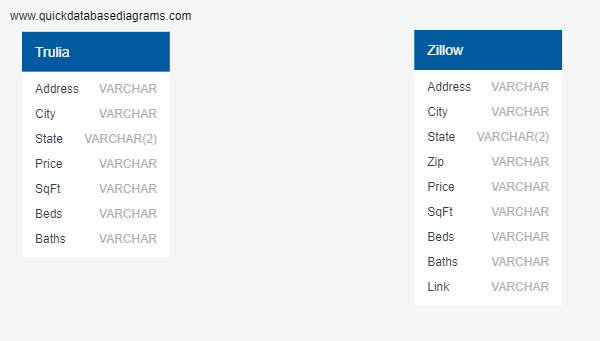

# Foreclosure Listings ETL Project

For our ETL project, we chose to look at foreclosures currently being listed along with a complete list of houses up for sale within the same market.  The output of this project consists of two tables.  This will set us up nicely for our second major project occurring in a few weeks time.  In that project, we will broaden our scope to look at all foreclosures in the state of Texas and run analyses to determine, which of the listings are the best "bang for the buck".  In other words, which if the foreclosure listings are the ones investors should pursue to get the greatest return on their investment.

For now, the following document will identify detail the technical aspeects of the current ETL project: where and how we got the data, or the **Extract** portion, what did we do to the data once we had it, or the **Transform** portion, and where we stored the finalized database, the **Load** portion.

## Extract

We conducted research to find the most comprehensive listing of foreclosures available to potential buyers today.  Most foreclosures were hidden within paid websites such as [auction.com](https://www.auction.com) or [Foreclosure Listings](https://www.foreclosurelistings.com).  Several websites had free listings. These websites only gave a subset of listings either based on the type of loan that was given, such as a [Freddie Mac](https://www.homesteps.com) or [Fannie Mae](https://homepath.com) type loan, or were properties listed as a bank sale by the bank, like [Wells Fargo](https://reo.wellsfargo.com)

### Zillow

One website had both a comprehensive set of foreclosures along with the ability to obtain these listings at no cost to us: [Zillow](https://www.zillow.com).  Zillow, however, put into a place a variety of steps to make sure that bots are not constantly crawling and scraping information from their website.  To ensure that we were able to obtain data from Zillow, the following measures were taking in our scraper:

* Usage of Selenium rather than Splinter to open the Chromedriver for scraping.

* Creation of a bot handler.  This would allow the person running the scarper 5 minutes to solve a test looking at crosswalks, cars, stoplights, etc to ensure that there was a human running the scraper and not just a bot.

* Creating lag time for each request, using numpy.random in order to create this lag time.  After a certain amount of instances with the bot handler, Zillow still locks the user out.  The creation of variable lag time into the scraping of data helps limit the mount of times the bot handler was called on Zillow's side.

* Limiting the data to one particular market.  Since all team members are currently living in the Austin area, we used Austin, Texas as our test market for the scraper.

Final output of the scraper gave us the following list of information by listing in **csv format**:

* Price, Address, (Bed)Rooms, Bathrooms, Area (sqft), and a link to the listing.

The scraper can be found at: 'Zillow Scrapper/zillowScrape.ipynb'
The data output of scraper can be found at: 'Zillow Scrapper/zillowOutput.csv'

### Truilia

Due to the difficulties we had with Zillow's bot handling along with the requirements of this assignment, our team chose to scrape a different website for a comprehensive look at home listings within the same market, [Truilia](https://www.trulia.com).  Trulia was a much easier website to scrape.  But first, we had to set up cookies to access the data in the website.  These cookies included:

* Setting Trulia's cookies to accept the following: 'text/html,application/xhtml+xml,application/xml;q=0.9,image/webp,image/apng,*/*;q=0.8,application/signed-exchange;v=b3;q=0.9'

* Setting Trulia's language to accept: 'en-US,en;q=0.9'

* Allowing us to cahce a resource but requiring us to revalidate it everytime we use it.

* Sending a signal to the server expressing our preference for an encrypted and authenticated response.

* Letting Chrome tell Trulia that we are using Chrome to make a request to it's website.

Once these cookies have been set, we set the market to be the same as the output of the Zillow data, Austin, Texas.  Final out out of the scaper gave us the following list of information by listing in **csv format**:

* Price, City, Address, Bedrooms, Bathrooms, HouseSize

The scraper can be found at: 'Trulia Scrapper/truliaScrape.ipynb'
The data output of the scraper can be found at: 'Trulia Scrapper/truliaOutput.csv'

## Transformation

### Zillow

Transofrmation of [zillowOutput.csv]('Zillow Scrapper/zillowOutput.csv') to a file that can be used in a database involved cleaning the data.  This process included the following:

* Taking out the comments about estimated price in the price column.  This was switched over to a fixed price instead using the number in the respective value.

* Taking out redundancies in the bedroom and bathroom columns by removing 'bd' and 'ba' respecitvely.  

* Renaming the area column to SqFt.

* Separating out the address into four columns: Address, City, State, and Zip.

* Finally, sorting the columns to be in the following order: Address, City, State, Zip, Price, SqFt, Beds, Baths, Link

Once the data was cleaned, we created a new file in **csv format**

The code for the transformation process can be found here: 'Zillow Scrapper/Transform_Zillow.ipynb'
The data output can be found here: 'Zillow Scrapper/Foreclosed_homes.csv'

### Trulia

Transformation of [truliaOutput.csv]('Trulia Scrapper/truliaOutput.csv') to a file that can be used in a database involved cleaning the data.  This process included the following:

* Removing the redundancies in the bedroom and bathroom columns by removing 'bd' and 'ba' respectively.  

* Renaming the houseSize column to sqFt.

* Separating out the city column into two separate columns: City and State.  In addition, if there was a neighborhood indentified in the webscrape and was a part of the 'city' column in truliaOutput.csv, then this neighborhood was removed.

* Finally, sorting the columns to be in the following order: Address, City, State, Zip, Price, SqFt, Beds, Baths

Once the data was cleaned, we created a new file in **csv format**

The code for the transformation process can be found here: 'Trulia Scrapper/Transform_Trulia.ipynb'
The data output can be found here: 'Zillow Scrapper/Cleaned_Trulia.csv'

## Load

### PostgreSQL

The two csv files created using the following code found at: 'Zillow Scrapper/Zillow_SQL_Table.sql' and 'Trulia Scrapper/Trulia_SQL_Table.sql'

This data was loaded into a PostgreSQL database.  While the database is currently non-relational, the expansion of information for our second main project will make this information relational.  Specifically, we intend to bring in information on a citywide basis.

Here is a view of the database:

